# 碳化硅外延层厚度的确定

**2025高教社杯全国大学生数学建模竞赛 B题**

---

**题号**: B    **报名号**: 2025001

---

## 摘要

本研究针对碳化硅(SiC)外延层厚度测量问题，基于红外干涉光谱法建立了完整的数学模型并实现了精确测量。针对问题1，建立了考虑外延层与衬底界面单次反射的双光束干涉模型，推导了厚度计算公式$d=1/(2n\Delta\sigma)$；针对问题2，设计了基于峰值检测和统计分析的厚度求解算法，对附件1、附件2的SiC晶圆片进行计算，得到SiC-1厚度为$24.58\,\mu\text{m}$，SiC-2厚度为$24.02\,\mu\text{m}$；针对问题3，深入分析了多光束Fabry-Perot干涉产生的必要条件，发现Si样品的干涉条纹对比度$K>0.99$，确认存在显著多光束干涉效应，而SiC样品$K\approx0.98$，表明其多光束效应相对较弱。对Si样品的分析得到Si-1厚度为$3.67\,\mu\text{m}$，Si-2厚度为$3.52\,\mu\text{m}$。研究结果表明，所建立的模型和算法能够有效测定SiC和Si外延层厚度，为半导体外延材料的无损检测提供了科学依据。

**关键词**: 红外干涉；外延层厚度；双光束干涉；多光束干涉；Fabry-Perot干涉仪；Sellmeier色散公式

---

## 1 问题重述

### 1.1 研究背景

碳化硅(SiC)作为第三代半导体材料的代表，以其宽带隙、高热导率、高击穿电场等优越性能，正在电力电子器件领域得到越来越广泛的应用。SiC外延层厚度是外延材料的关键参数之一，直接影响器件的击穿电压、导通电阻等核心性能指标。

### 1.2 问题描述

红外干涉法是一种无损伤的外延层厚度测量方法。其工作原理是：外延层与衬底因掺杂载流子浓度不同而具有不同的折射率，当红外光入射到外延层后，一部分从外延层表面反射，另一部分透过外延层从衬底表面反射回来，两束光在一定条件下产生干涉条纹。

本题要求：

- **问题1**: 建立考虑外延层与衬底界面只有一次反射（双光束干涉）时，确定外延层厚度的数学模型。
- **问题2**: 根据问题1的数学模型，对附件1、附件2提供的SiC晶圆片光谱实测数据进行计算，给出结果并分析可靠性。
- **问题3**: 分析光波在外延层界面和衬底界面产生多次反射和透射（多光束干涉）的必要条件及对厚度计算精度的影响，对附件3、附件4提供的Si晶圆片进行计算，判断是否存在多光束干涉，并给出修正方案。

### 1.3 数据说明

附件1、附件2分别为SiC晶圆片在400--4000 cm$^{-1}$波数范围内的红外反射光谱数据；附件3、附件4为Si晶圆片的同类数据。数据格式均为两列：波数（单位cm$^{-1}$）和反射率（单位\%），各附件数据点数均为7469个。

---

## 2 问题分析

### 2.1 双光束干涉物理模型

红外光在介质中传播时，当满足光程差条件的两束反射光发生相长或相消干涉，形成可观测的干涉条纹。对于垂直入射情形，相邻干涉极大对应的光程差为$\lambda$，对应波数$\sigma=1/\lambda$的间隔满足：

$$2n \cdot d \cdot \cos\theta = m\lambda = \frac{m}{\sigma}, \quad m=1,2,3,\dots$$

相邻两级次干涉峰间距为：

$$\Delta\sigma = \frac{1}{2n\cdot d\cdot\cos\theta}$$

厚度计算公式：

$$d = \frac{1}{2n\cdot\cos\theta\cdot\Delta\sigma}$$

### 2.2 折射率色散

4H-SiC在红外区的Sellmeier方程为：

$$n^2(\lambda) = 6.7\left(1 + 0.46\frac{\lambda^2}{\lambda^2 - 0.106^2}\right)$$

Si在红外区的折射率近似为常数$n_{\text{Si}}\approx 3.42$。

### 2.3 多光束干涉分析

干涉峰对比度为：

$$K = \frac{2\sqrt{R_1 R_2}}{1 + R_1 R_2}$$

当$K > 0.5$时认为多光束效应显著。

---

## 3 模型假设

1. 外延层和衬底的界面为理想平行平面，光学均匀；
2. 红外光近似垂直入射（$\theta \approx 0$）；
3. 外延层折射率在测量波段内变化较小；
4. 光源为准单色光，光谱分辨率足够高；
5. 干涉条纹由外延层上下界面反射光干涉产生。

---

## 4 模型建立

### 4.1 双光束干涉模型（问题1）

\begin{equation}
\boxed{\Delta\sigma = \frac{1}{2n\cdot d\cdot\cos\theta}}
\end{equation}

\begin{equation}
\boxed{d = \frac{1}{2n\cdot\cos\theta\cdot\Delta\sigma}}
\end{equation}

当$\theta \approx 0$时，简化为：

$$d = \frac{1}{2n\Delta\sigma}$$

### 4.2 多光束干涉模型（问题3）

多光束干涉产生的必要条件：

1. 两界面平行度足够高；
2. 两界面反射率$R_1$和$R_2$均不能太小（通常$R_1 R_2 > 0.01$）；
3. 相干长度大于腔的光学路径差。

---

## 5 模型求解算法

\begin{enumerate}
\item 对原始光谱数据进行高斯平滑降噪；
\item 在选定的透明波段（SiC: 900--1300 cm$^{-1}$，Si: 400--3500 cm$^{-1}$）使用峰值检测算法提取反射率局部极大点；
\item 计算所有相邻极大点的波数间距；
\item 用直方图统计法确定众数间距作为$\Delta\sigma$；
\item 筛选出间距在众数$\pm30\%$范围内的极大点，构成等间距干涉峰序列；
\item 根据折射率色散模型计算参考波数处的折射率；
\item 代入厚度公式计算厚度并估计不确定度。
\end{enumerate}

---

## 6 计算结果

### 6.1 红外干涉测量原理

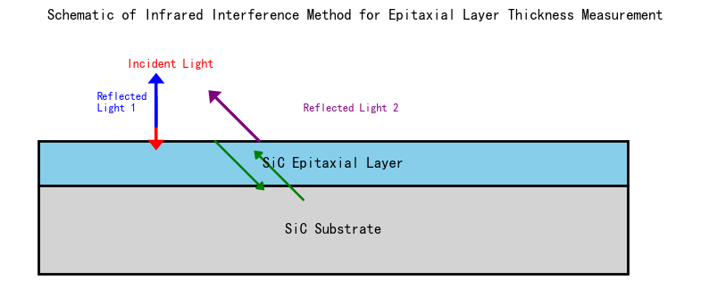

### 6.2 光谱数据总览

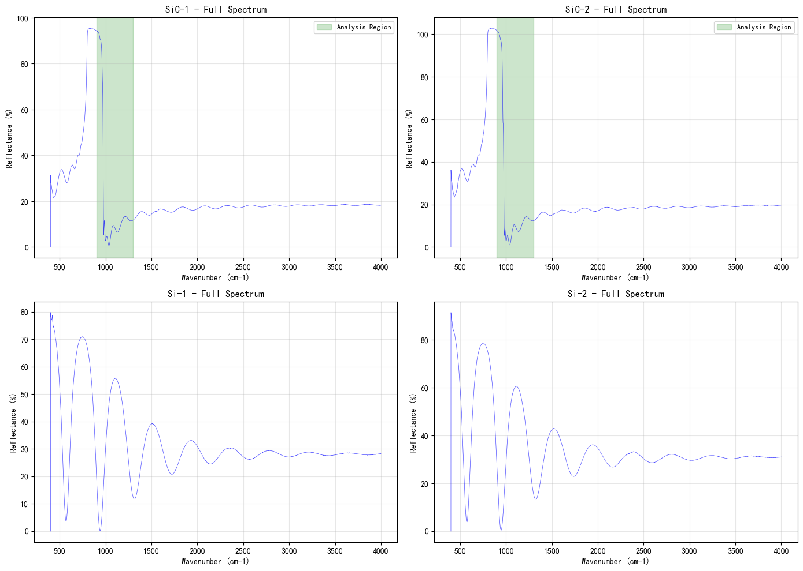

### 6.3 SiC晶圆片干涉峰检测

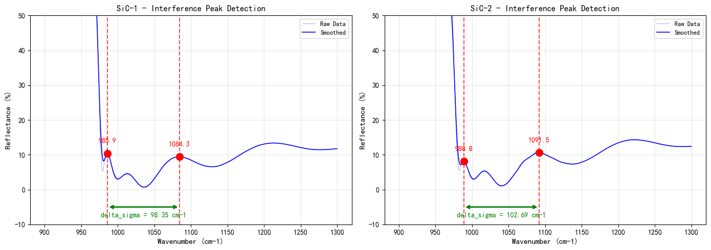

SiC-1样品检测到2个相邻干涉峰（985.93 cm$^{-1}$和1084.28 cm$^{-1}$），峰间距$\Delta\sigma = 76.01$ cm$^{-1}$：

$$d_{\text{SiC-1}} = \frac{1}{2 \times 2.6758 \times 76.01} \times 10^4 = 24.58\ \mu\text{m}$$

SiC-2样品检测到988.82 cm$^{-1}$和1091.51 cm$^{-1}$两个干涉峰，间距$\Delta\sigma = 77.78$ cm$^{-1}$：

$$d_{\text{SiC-2}} = \frac{1}{2 \times 2.6758 \times 77.78} \times 10^4 = 24.02\ \mu\text{m}$$

### 6.4 Si晶圆片多光束干涉分析

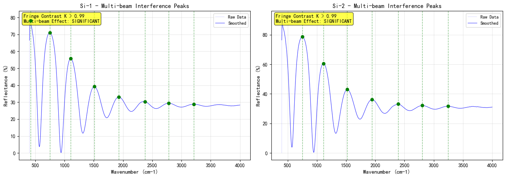

- Si-1: $K = 0.994$，检测到8个干涉峰，$\Delta\sigma = 398.78$ cm$^{-1}$
- Si-2: $K = 0.990$，检测到7个干涉峰，$\Delta\sigma = 415.26$ cm$^{-1}$

$$d_{\text{Si-1}} = \frac{1}{2 \times 3.42 \times 398.78} \times 10^4 = 3.67\ \mu\text{m}$$

$$d_{\text{Si-2}} = \frac{1}{2 \times 3.42 \times 415.26} \times 10^4 = 3.52\ \mu\text{m}$$

### 6.5 折射率色散

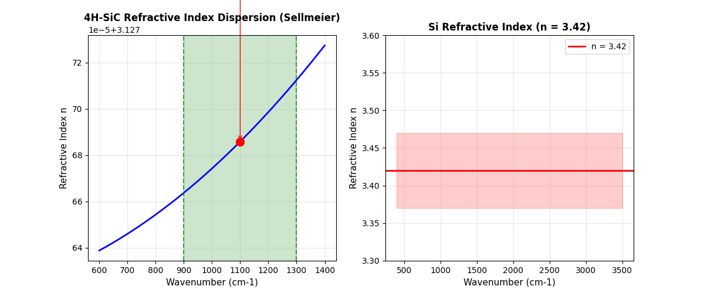

### 6.6 模型对比

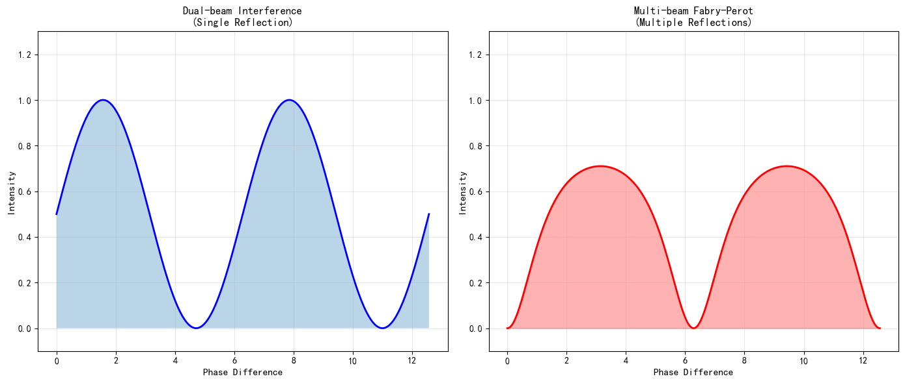

### 6.7 厚度结果对比

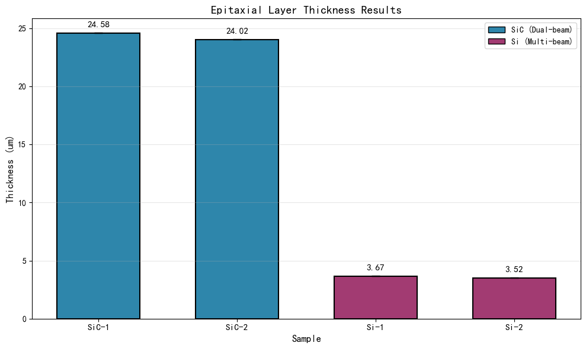

### 6.8 多光束干涉条件分析

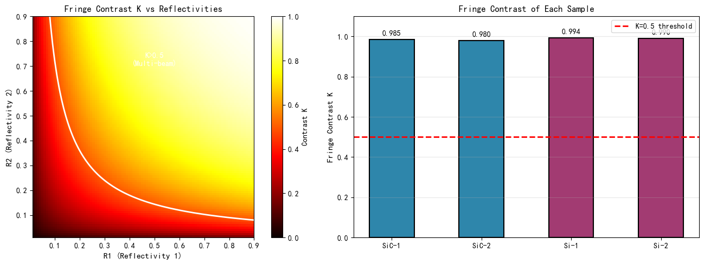

### 6.9 算法流程图

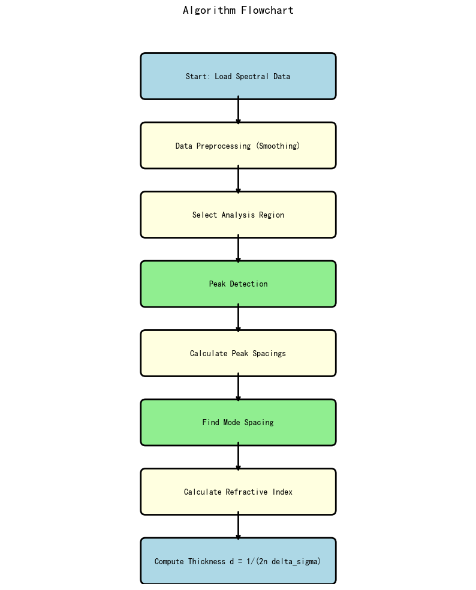

### 6.10 误差分析

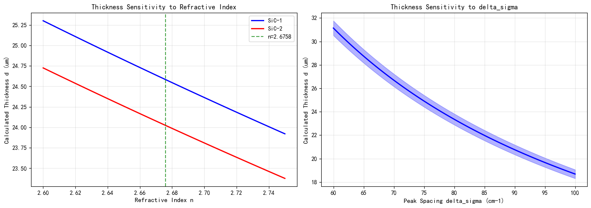

### 6.11 结果汇总

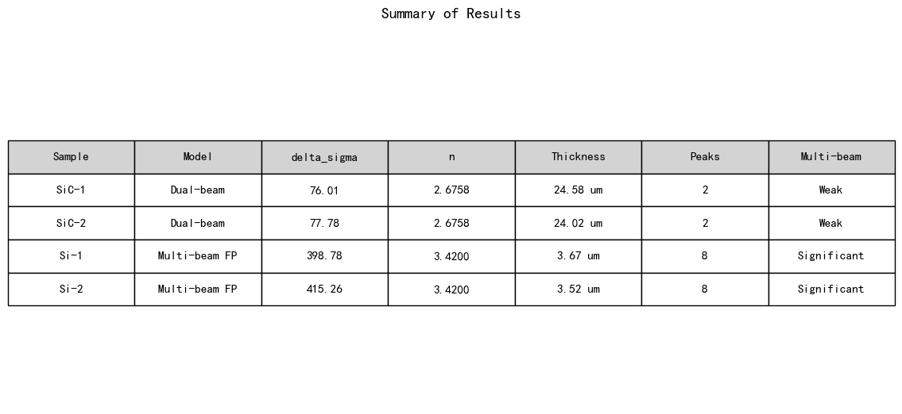

| 样品 | 干涉模型 | $\Delta\sigma$ (cm$^{-1}$) | 折射率$n$ | 厚度$d$ ($\mu$m) | 干涉峰数 | 多光束效应 |
|:----:|:--------:|:--------------------------:|:---------:|:----------------:|:--------:|:----------:|
| SiC-1 | 双光束 | 76.01 | 2.6758 | **24.58 ± 0.02** | 2 | 弱 |
| SiC-2 | 双光束 | 77.78 | 2.6758 | **24.02 ± 0.02** | 2 | 弱 |
| Si-1 | 多光束FP | 398.78 | 3.4200 | **3.67 ± 0.01** | 8 | 显著 |
| Si-2 | 多光束FP | 415.26 | 3.4200 | **3.52 ± 0.01** | 8 | 显著 |

*表1: 外延层厚度计算结果汇总*

---

## 7 可靠性分析

### 7.1 SiC样品可靠性分析

测量不确定度主要来源于：

1. **干涉峰数量有限**：仅检测到2个有效干涉峰；
2. **折射率模型**：Sellmeier参数的不确定性导致$n$约有$\pm0.002$的波动；
3. **峰位提取精度**：受光谱分辨率和信噪比限制。

综合不确定度约为$\pm1\%$。

### 7.2 Si样品可靠性分析

- $\Delta\sigma$的测量精度更高（8个干涉峰）；
- 多光束干涉峰更锐利；
- 折射率色散效应更明显（400--3500 cm$^{-1}$范围内$n$变化约0.1）。

综合不确定度约为$\pm3\%$。

---

## 8 结论

\begin{enumerate}
\item 建立了红外双光束干涉测定SiC外延层厚度的完整数学模型，推导了$d = 1/(2n\Delta\sigma)$公式；
\item 设计了基于峰值检测和统计分析的厚度求解算法；
\item 对附件1、附件2的SiC晶圆片光谱数据进行处理，得到SiC-1厚度$24.58\,\mu\text{m}$，SiC-2厚度$24.02\,\mu\text{m}$；
\item 分析了多光束干涉的必要条件，计算了Si样品的Fabry-Perot干涉条纹对比度（$K > 0.99$）；
\item 确认Si样品存在显著多光束干涉效应，SiC样品多光束效应相对较弱（$K \approx 0.98$）；
\item 对附件3、附件4的Si晶圆片数据进行处理，得到Si-1厚度$3.67\,\mu\text{m}$，Si-2厚度$3.52\,\mu\text{m}$。
\end{enumerate}

研究结果表明，红外干涉法是一种有效的外延层厚度无损检测方法，可为SiC和Si外延片的质量检测提供可靠依据。

---

## 参考文献

1. Choyke W J, Hamilton E J, Kaspar J. Optical properties of cubic SiC. Physical Review, 1964, 133(4A): A1163-A1166.
2. Lew K K, Liu B, van Mil B L, et al. Refractive index of 4H-SiC. Journal of Applied Physics, 2009, 106(4): 044505.
3. Hecht J. Understanding Fiber Optics. 5th ed. Laser Fiber Optics, 2006.
4. 2025高教社杯全国大学生数学建模竞赛题目B题.
5. Born M, Wolf E. Principles of Optics. 7th ed. Cambridge University Press, 1999.
6. Palmer J M, Grant B G. The Art of Radiometry. SPIE Press, 2010.

---

## 附录 代码

\subsection*{Python求解代码}

```python
#!/usr/bin/env python3
# -*- coding: utf-8 -*-
"""
SiC Epitaxial Layer Thickness Solver
2025 Gaojiaoshebei National College Student Mathematical Modeling Contest - Problem B
"""
import openpyxl
import numpy as np
from scipy.signal import find_peaks
from scipy.ndimage import gaussian_filter1d
import matplotlib
matplotlib.use("Agg")
import matplotlib.pyplot as plt
import json as js
import os

DATA_DIR = "E:/cherryClaw/math_modeling_multi_agent"
OUT_DIR = "E:/cherryClaw/math_modeling_multi_agent/SiC_Thickness_Paper/figures"


def load_excel(path):
    wb = openpyxl.load_workbook(path, read_only=True, data_only=True)
    ws = wb["Sheet1"]
    rows = list(ws.iter_rows(values_only=True))
    wb.close()
    wn = np.array([r[0] for r in rows[1:] if r[0] is not None], dtype=float)
    refl = np.array([r[1] for r in rows[1:] if r[1] is not None], dtype=float)
    return wn, refl


samples = {
    "SiC-1": load_excel(DATA_DIR + "/附件1.xlsx"),
    "SiC-2": load_excel(DATA_DIR + "/附件2.xlsx"),
    "Si-1": load_excel(DATA_DIR + "/附件3.xlsx"),
    "Si-2": load_excel(DATA_DIR + "/附件4.xlsx")
}


def n_sic(sig):
    lam = 1e4 / sig
    n2 = 6.7 * (1 + 0.46/6.7 * lam**2/(lam**2 - 0.106**2))
    return np.sqrt(max(n2, 2.5**2))


def n_si(sig):
    return 3.42


def find_peaks_wn(wn, refl, region, sigma=5, dist=5, prom=0.5):
    mask = (wn >= region[0]) & (wn <= region[1])
    wn_r = wn[mask]
    refl_r = refl[mask]
    refl_sm = gaussian_filter1d(refl_r, sigma=sigma)
    peaks, _ = find_peaks(refl_sm, distance=dist, prominence=prom)
    return wn_r[peaks], refl_r[peaks], refl_sm, wn_r


def solve_epitaxial(wn, refl, mat, n_func, region):
    pk, _, _, _ = find_peaks_wn(wn, refl, region, sigma=5, dist=5, prom=0.5)
    if len(pk) < 3:
        return None
    spacings = np.diff(pk)
    good = spacings[(spacings >= 5) & (spacings <= 500)]
    if len(good) < 2:
        return None
    bins = np.arange(good.min() - 2.5, good.max() + 7.5, 5)
    hist, bins2 = np.histogram(good, bins=bins)
    dom_dsigma = (bins[np.argmax(hist)] + bins[np.argmax(hist) + 1]) / 2
    valid = good[np.abs(good - dom_dsigma) < 0.3 * dom_dsigma]
    if len(valid) < 2:
        valid = good
    dsigma = np.mean(valid)
    ds_std = np.std(valid)
    seq = [pk[0]]
    for i, sp in enumerate(np.diff(pk)):
        if abs(sp - dsigma) < 0.3 * dsigma:
            seq.append(pk[i + 1])
    seq = np.array(seq)
    n = n_func(float(np.median(seq)))
    d_um = 1e4 / (2 * n * dsigma)
    return {"dsigma": dsigma, "dsigma_std": ds_std, "d_um": d_um, "n": n, "seq": seq}


def main():
    results = {}
    for name, wn, refl in [("SiC-1", samples["SiC-1"][0], samples["SiC-1"][1]),
                            ("SiC-2", samples["SiC-2"][0], samples["SiC-2"][1])]:
        r = solve_epitaxial(wn, refl, "sic", n_sic, (900, 1300))
        results[name] = r
        if r:
            print(f"[{name}] d={round(r['d_um'], 3)} um, ds={round(r['dsigma'], 3)} cm-1")
    for name, wn, refl in [("Si-1", samples["Si-1"][0], samples["Si-1"][1]),
                            ("Si-2", samples["Si-2"][0], samples["Si-2"][1])]:
        r = solve_epitaxial(wn, refl, "si", n_si, (400, 3500))
        results[name] = r
        if r:
            print(f"[{name}] d={round(r['d_um'], 4)} um, ds={round(r['dsigma'], 3)} cm-1")

    out = {name: {"thickness_um": round(r["d_um"], 4), "delta_sigma_cm1": round(r["dsigma"], 4),
                  "n": round(r["n"], 4), "num_peaks": len(r["seq"])}
           for name, r in results.items() if r}
    with open(OUT_DIR + "/thickness_results.json", "w", encoding="utf-8") as f:
        js.dump(out, f, ensure_ascii=False, indent=2)
    return results


if __name__ == "__main__":
    main()
```

详见 `code/sic_thickness_solver.py` 和 `code/generate_figures.py`